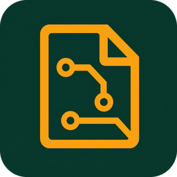

<p align="center">
  
</p>

# KiLog

KiLog is a KiCad 9/10 PCB Editor plugin for recording unsaved board changes,
replaying them from JSON, and applying a small set of board-editing helpers. It
communicates with the active PCB Editor through KiCad's IPC API.

## Features

- Record live PCB edits as UUID-addressed JSON operations.
- Preview, undo, truncate, and mark positions in a recording.
- Replay a log step by step or at `0.25×`–`4×` speed.
- Create full-board copper zones on `F.Cu`, `B.Cu`, or both.
- Fan out matching SMD pads with orthogonal traces and through vias.

## Installation

Copy this repository to the KiCad plugin directory:

- Windows: `%USERPROFILE%\Documents\KiCad\<version>\plugins\KiLog`
- macOS: `~/Documents/KiCad/<version>/plugins/KiLog`
- Linux: `~/.local/share/KiCad/<version>/plugins/KiLog`

In PCB Editor, enable the IPC API under **Preferences > Plugins**, then reload
the plugins or restart PCB Editor. Open a board before launching KiLog.

## Record

The **Log** field controls the output prefix. If it contains `ref`, files are
written beside the open PCB as:

- `ref.json` — the operation log.
- `ref_000.kicad_pcb`, `ref_001.kicad_pcb`, … — marked board states, numbered by
  their actual position in the operation sequence.

The centre button first restores the open PCB to its last saved on-disk state,
then starts recording. It changes to **Stop** while recording. If the JSON file
already exists, KiLog asks before replacing it.

While recording:

- **Back / Next** previews recorded positions.
- Dragging the progress bar seeks to a recorded position.
- **Reset** accepts the preview, removes all later operations, and continues
  recording from that state.
- **Stop** also accepts the currently previewed position before ending.
- **Mark** saves the current position as a `.kicad_pcb` copy.
- **Ctrl+Z** accepts a preview, or removes the latest operation when no preview
  is active.

## Replay

Choose **Load** on the Replay tab and select a KiLog JSON file. KiLog restores
the PCB named by `initial_pcb_path` to its saved state before applying the log.

> **Warning:** loading a replay discards unsaved edits in the open PCB. Save
> unrelated work first, and open the PCB referenced by the log.

Replay controls provide reset-to-start, previous, play/pause, next, and mark.
The progress bar seeks to any step. Seeking backward restores a cached earlier
state; playback changes are placed on KiCad's undo stack but are not saved to
disk automatically.

## Board helpers

### Copper zones

On the **Skill** tab, enter an existing net, select `F.Cu`, `B.Cu`, or both, and
choose **Fill**. KiLog creates one full-board zone per selected layer in a single
undoable commit. The zones are intentionally left unfilled; refill them in
KiCad when ready. Active recording captures them as `zone.add` operations.

### Fanout

Enter an existing net and a fallback track width in millimetres, then choose
**Fanout**. For each matching on-board SMD pad, KiLog creates an orthogonal trace
and a 0.6/0.3 mm through via in one undoable commit.

Fanout behavior:

- Front-side footprints use `F.Cu`; back-side footprints use `B.Cu`.
- A connected same-net trace supplies the width; otherwise the UI value is used.
- Vias stay inside the closed `Edge.Cuts` outline and outside cut-outs.
- Placement avoids other on-board pads and existing vias.
- Pads already connected to a same-net via are skipped, so repeated runs do not
  duplicate completed fanouts.

## Log format

Changes captured together are stored under one step and replayed as one atomic
KiCad commit, without exposing intermediate object states. Footprint placement, movement, and
rotation are stored as `footprint.move`; consecutive transforms keep only the
latest position and angle.

Persisted changes describe only their replay target: complete additions use
`item` with the exact KiCad `type` and `data` (including `data.id.value`), field
updates use `value`, and field removals use `delete: true`. The recording JSON
does not store the redundant item `kind` or `item_uuid`, or any `before` and
`after` values. Changes without a complete `item` use the shorter `id` field.
Each numbered `step` has one `step_uuid`; individual changes do not carry UUIDs.

Footprints outside the live `Edge.Cuts` boundary are ignored. Moving a footprint
into the board is recorded; moving it out does not preserve the outside position.

```json
{
  "initial_pcb_path": "C:/project/board.kicad_pcb",
  "steps": [
    {
      "step": 1,
      "step_uuid": "...",
      "changes": [
        {
          "id": "...",
          "operation": "footprint.move",
          "position": {"x_nm": "10000000", "y_nm": "20000000"},
          "orientation": {"value_degrees": 270}
        }
      ]
    }
  ]
}
```

The schema is available at
[`kilog/schemas/operation-log-v1.schema.json`](kilog/schemas/operation-log-v1.schema.json).

## Project layout

- `kilog_action.py` — KiCad entry point and DPI bootstrap.
- `kilog/recorder.py` — recording state and log persistence.
- `kilog/replay.py` — log validation and playback controller.
- `kilog/kicad_adapter.py` — KiCad IPC reads, writes, and board helpers.
- `kilog/ui.py` — wxPython control panel.
- `tests/` — unit tests using fake board adapters.

## Development

Requires Python 3.10 or newer.

```powershell
python -m venv .venv
.\.venv\Scripts\python.exe -m pip install -r requirements-dev.txt
.\.venv\Scripts\python.exe -m pytest -q
```

See [CHANGELOG.md](CHANGELOG.md) for release history.
